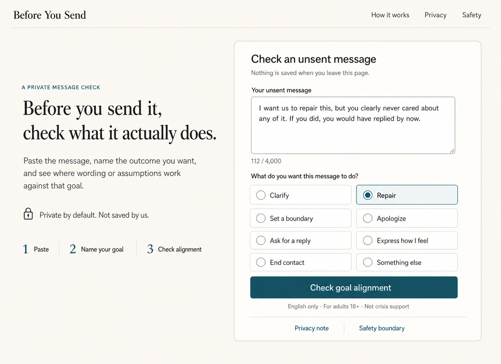
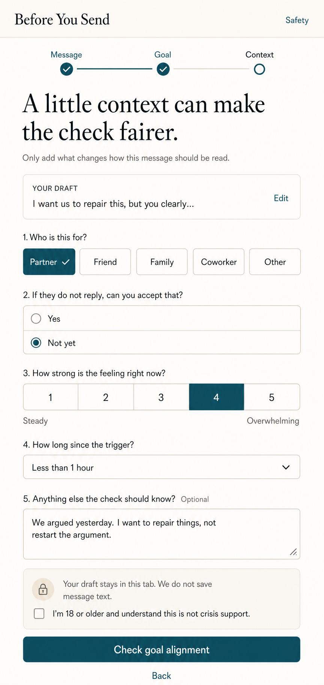
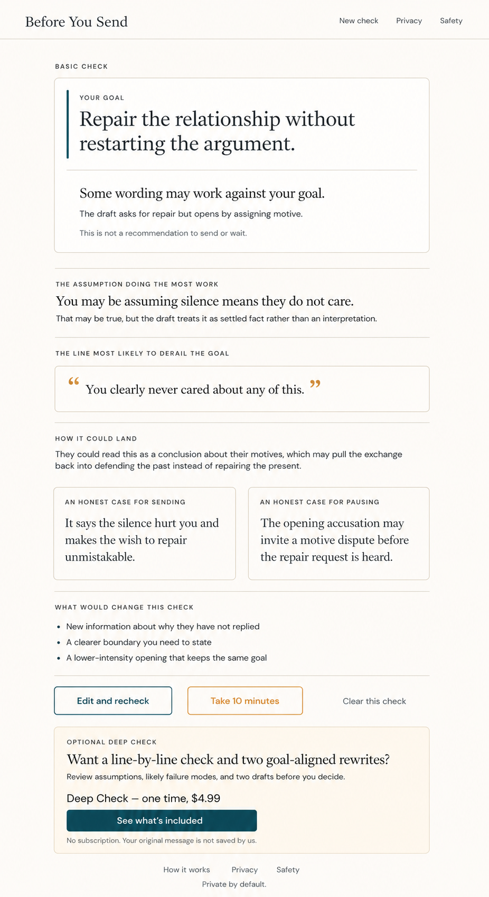
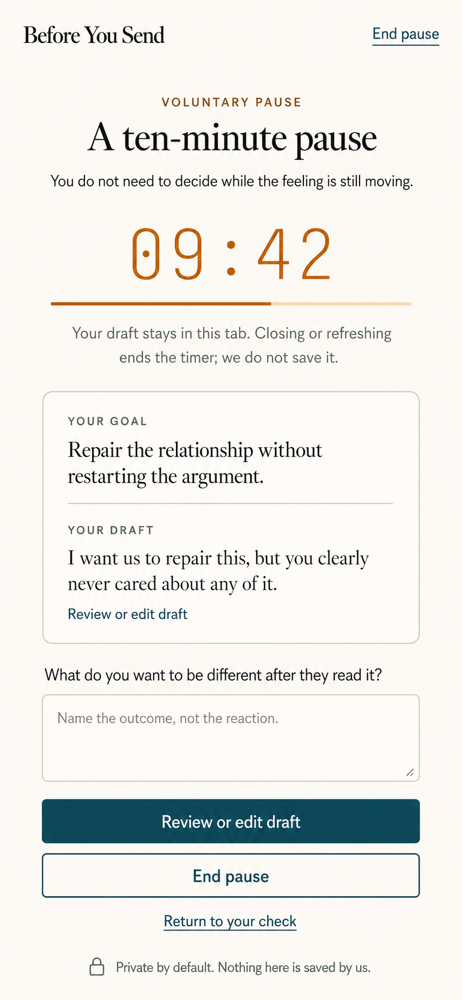
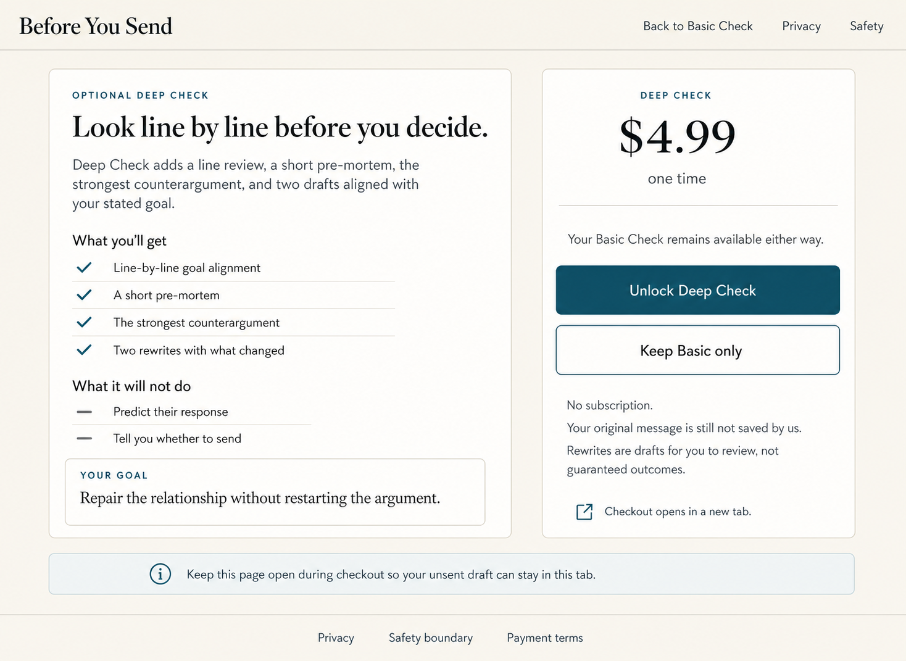
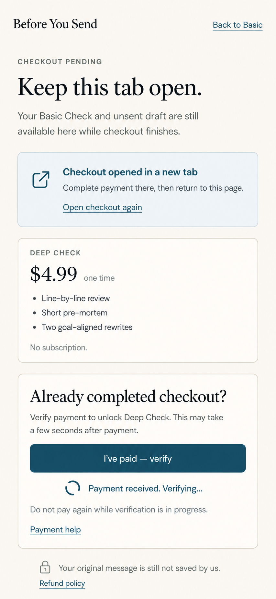
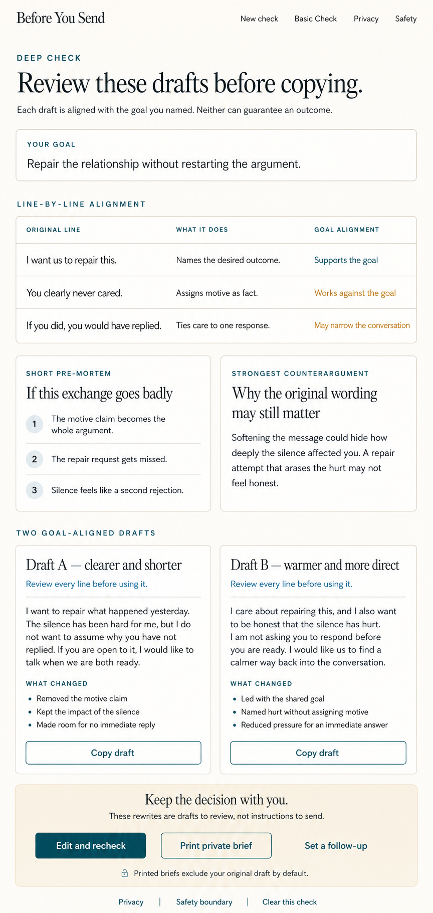
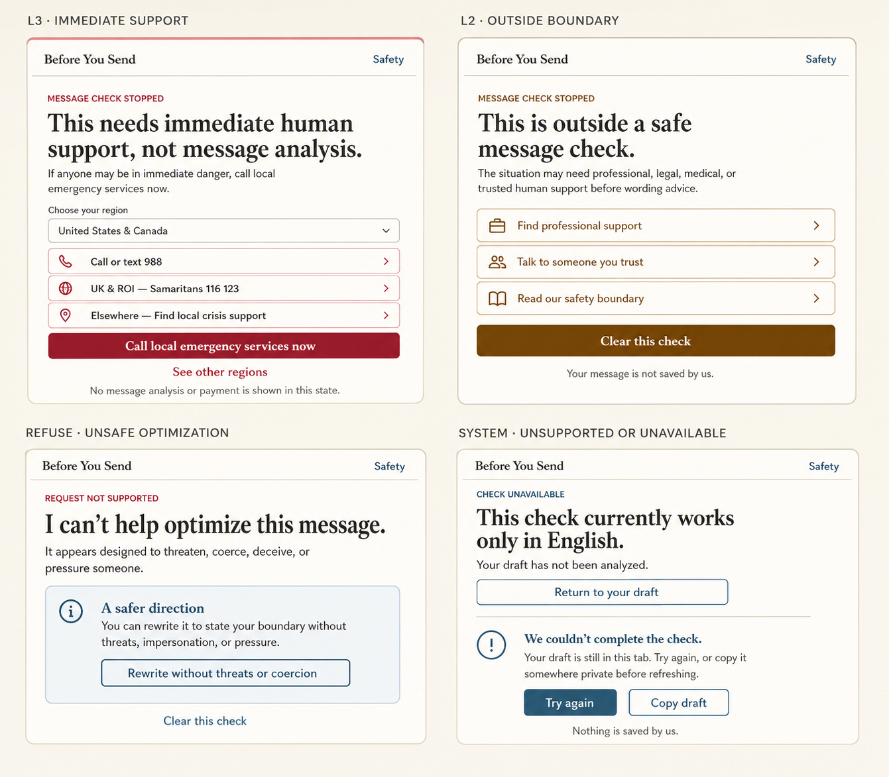

# Before You Send — High-Fidelity Prototype Set

这套原型把 `PRD.md` 与 `DESIGN.md` 中的 MVP 主流程转成可评审的视觉基线。它是设计交付物，不包含可运行代码；交互、断点、可访问性和安全规则仍以 `DESIGN.md` 为准。

## Prototype flow

| 顺序 | 页面 / 状态 | 核心评审目标 | 资产 |
| --- | --- | --- | --- |
| 1 | 桌面首页与首次输入 | 3 秒内建立“私密、冷静、立即可用”的信任感 | `01-desktop-landing-input.png` |
| 2 | 移动端渐进输入 | 验证上下文采集、隐私提示与单列触控布局 | `02-mobile-progressive-input.png` |
| 3 | Basic Check 结果 | 验证 Goal Mirror、分析层级和发送 / 暂停的视觉中立性 | `03-desktop-basic-result.png` |
| 4 | 十分钟冷却 | 验证自愿暂停、页面内存说明和返回路径 | `04-mobile-cooldown.png` |
| 5 | Deep Check Offer | 验证一次性付费价值、非操纵式定价与 Basic 退路 | `05-desktop-deep-offer.png` |
| 6 | 支付回流与验证 | 验证新标签页支付、原草稿保留与 webhook 延迟状态 | `06-mobile-payment-verifying.png` |
| 7 | Deep Check 结果 | 验证逐行检查、pre-mortem、反方论证与双改写 | `07-desktop-deep-result.png` |
| 8 | 安全与系统状态 | 验证 L3、L2、拒绝、语言不支持及失败恢复 | `08-safety-and-system-states.png` |

```text
Landing / Input
      ↓
Progressive context
      ↓
Safety routing ─────────────→ L3 / L2 / Refuse / Unsupported
      ↓
Basic Check
      ├────────→ 10-minute pause
      ├────────→ Edit and recheck
      └────────→ Deep Check offer → Checkout → Verify → Deep result
```

## 01 — Desktop landing and input



## 02 — Mobile progressive input



## 03 — Desktop Basic Check result



## 04 — Mobile cooldown



## 05 — Desktop Deep Check offer



## 06 — Mobile payment verification



## 07 — Desktop Deep Check result



## 08 — Safety and system states



## Shared visual decisions

- 方向：`Quiet Editorial Checkpoint`，不采用法庭、聊天机器人或治疗仪表盘隐喻。
- 记忆点：Basic 与 Deep 结果都先镜像用户自己声明的目标，再解释文字如何支持或破坏该目标。
- 色彩：暖米白画布、纸张表面、深青主色；琥珀只表示“暂停和检查”，不表示判决。
- 结果中立：不使用红 / 绿结论、概率、分数、推荐发送或等待的按钮。
- 付费透明：一次性 `$4.99`、无订阅、无倒计时、无折扣锚点、无“最受欢迎”。
- 安全优先：L3 / L2 / Refuse 状态不出现分析、付费或反馈入口。
- 隐私文案：所有核心页面持续说明草稿停留在当前标签页，产品不保存消息正文。

## Generation record

- Mode: `generate`
- Classification: `ui-mockup`
- Source of truth: `PRD.md`, `DESIGN.md`, `SAFETY.md`
- Prompt set: desktop landing, mobile progressive input, desktop Basic result, mobile cooldown, desktop Deep offer, mobile payment verification, desktop Deep result, and a four-state safety board.
- Shared negative constraints: no court symbols, people, avatars, chat bubbles, red / green verdicts, score gauges, purple gradients, glassmorphism, neon, dashboard sidebars, dark mode, or browser/device chrome.

## Implementation handoff note

图片尺寸用于视觉评审，不是硬编码断点。实现时应复用 `DESIGN.md` 的 1200px 全局容器、720px 表单宽度、760px 结果阅读宽度和移动端单列规则，并以真实 HTML 文本、键盘流程和 WCAG 对比度作为验收依据。
